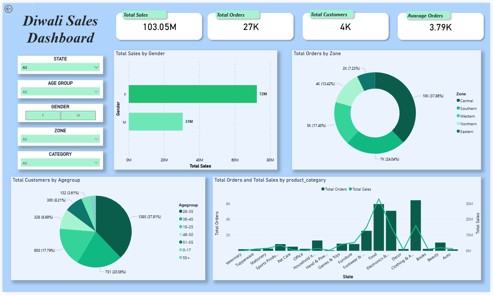

# Diwali Sales Dashboard

An interactive Power BI dashboard analyzing Diwali sales performance across customer demographics, zones, and product categories.

## 📊 Dashboard Preview

## 🎯 Objective
Analyze Diwali sales transaction data to uncover purchasing patterns across gender, age groups, zones, and product categories — supporting data-driven marketing decisions.

## 🔑 Key Insights
- Total Sales: ₹103.05M across 27K orders and 4K customers
- Female customers drove ~70% of total sales
- The 26-35 age group made up the largest customer base (37.91%)
- Food and Electronics emerged as the top-performing categories
- Central and Southern zones led in order volume

## 🛠️ Tools Used
- **Power BI** — dashboard design, DAX measures
- **Excel/Python** — data cleaning and preprocessing

## 📁 Dashboard Features
- KPI cards: Total Sales, Total Orders, Total Customers, Average Order Value
- Gender-wise and age-group sales breakdown
- Zone-wise order distribution (donut chart)
- Category-wise orders and sales trend
- Interactive slicers: State, Age Group, Gender, Zone, Category

## 📈 How to Use
1. Download `Diwali_Sales_Dashboard.pbix`
2. Open in Power BI Desktop
3. Use slicers to explore data by state, zone, or demographic

## 👤 Author
Ashvedh Bhosale — [LinkedIn](your-linkedin-url) | [Portfolio/GitHub](your-github-url)
